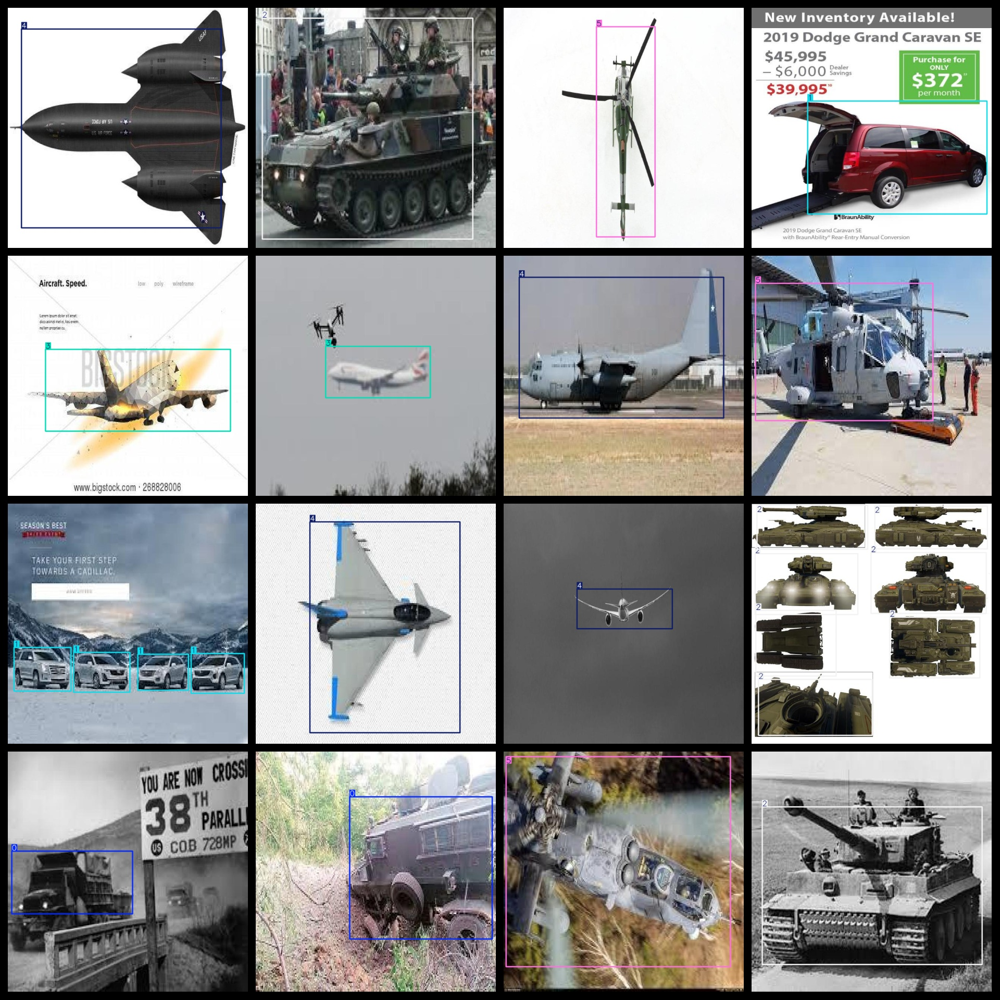
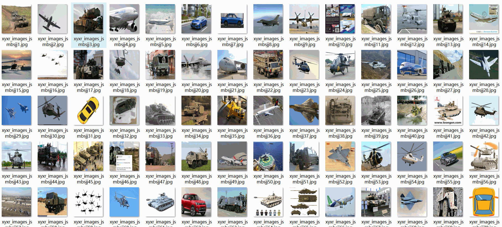

# [Object Detection] Military and Civilian Aircraft Truck Tank Dataset 6527 imagesYOLO+VOC format

【Target Detection】Military and Civil Aviation, Truck, Tank Dataset 6527 Images in YOLO+VOC Format

Dataset Format: VOC format + YOLO format

The compressed file contains: three folders, each storing images, xml files, and text files.

Total jpg images in JPEGImages folder: 6527

The total number of XML files in the Annotations folder: 6527.

The total number of txt files in the labels folder is: 6527.

Number of tag types: 6

Tag names: ["0","1","2","3","4","5"]

Label Comparison: ["0 Utility Truck", "1 Civilian Car", "2 Tank", "3 Civil Aircraft", "4 Combat Aircraft", "5 Helicopter"]

The number of boxes for each label (Note that the order of labels in the Yolo format does not correspond to this, but is based on the classes.txt file in the labels folder):

0 frame count = 1383

1 frame count = 2133

2 frame count = 2375

3 frame count = 1338

4 frame count = 1596

5 frame count = 1644

Total boxes: 10469

Picture clarity (Resolution: Pixels): Clear

Is the image enhanced: No

Shape of the label: Rectangular box, used for object detection and recognition.

Important Note: None

Special Notice: This dataset does not guarantee the accuracy or precision of the trained models or weight files. The dataset only provides accurate and reasonable annotations.

## Images

---

Here is a pay link on Stripe (https://buy.stripe.com/3cs8yP7sY87d0vu9AB). Please contact me lonlonago@foxmail.com after funding $89, and I will send you a complete data files, thank you!

